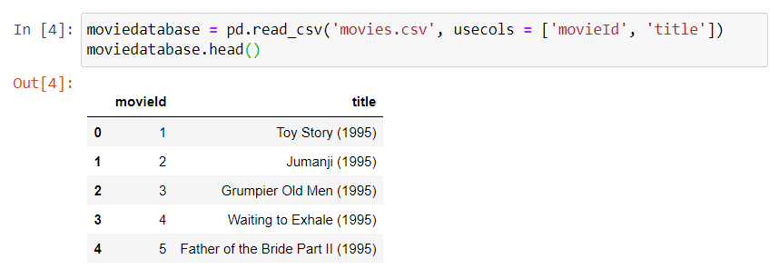
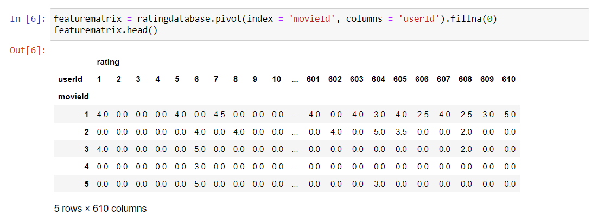
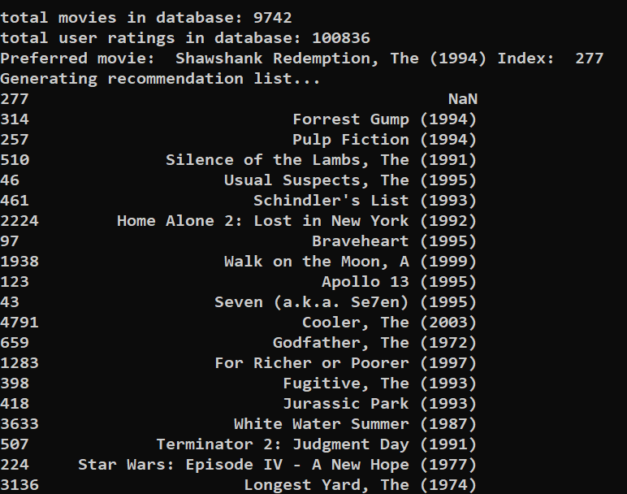

#Results

A google doc file with the same data is available **[here](https://docs.google.com/document/d/1yw0Ei7IuAs22V20XGCpPvW75vsh8-Uvo/edit?usp=sharing&ouid=117806499075101418555&rtpof=true&sd=true)**

The even though the program only outputs a list of desired movies, it does a few things to aid the final outcome.

  moviedatabase = pd.read_csv('movies.csv', usecols = ['movieId', 'title'])
  moviedatabase.head()

  ratingdatabase = pd.read_csv('ratings.csv', usecols = ['userId', 'movieId', 'rating'])
  ratingdatabase.head()

These two command statements clean and reduce the initial datasets into a database finally used in the calculations.

  featurematrix = ratingdatabase.pivot(index = 'movieId', columns = 'userId').fillna(0)
  featurematrix.head()

This command makes a matrix using the data in **moviedatabase** and **ratingdatabase**.

The final execution of the command results in a list of recommended movies based on the input movie:

